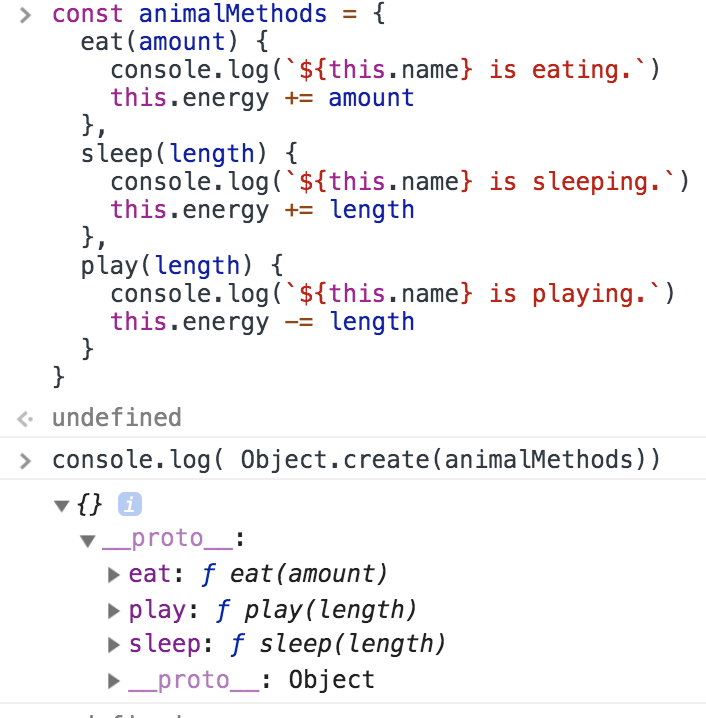

Creating a user-defined object requires two steps:

Define the object type by writing a function.
Create an instance of the object with new.
```javascript
new Foo // is equivalent to new Foo()
```
```javascript
function Car(){}
const car = new Car
car.constructor == Car // true
car instanceof Car // true
```
```javascript
function Car(){}
Car.prototype = {} // Assign object to F.prototype
const car = new Car
car.constructor == Car // false
car instanceof Car // true
```

